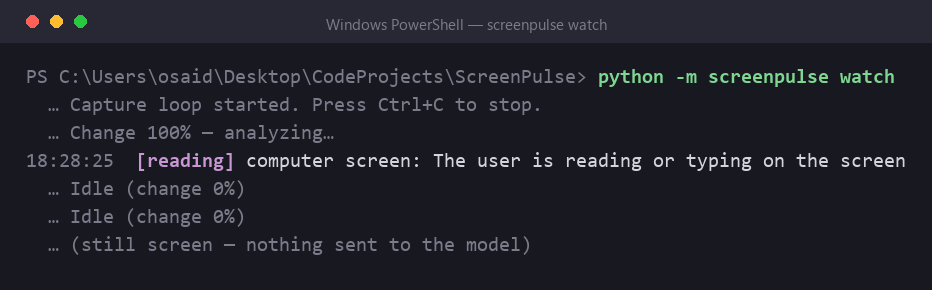
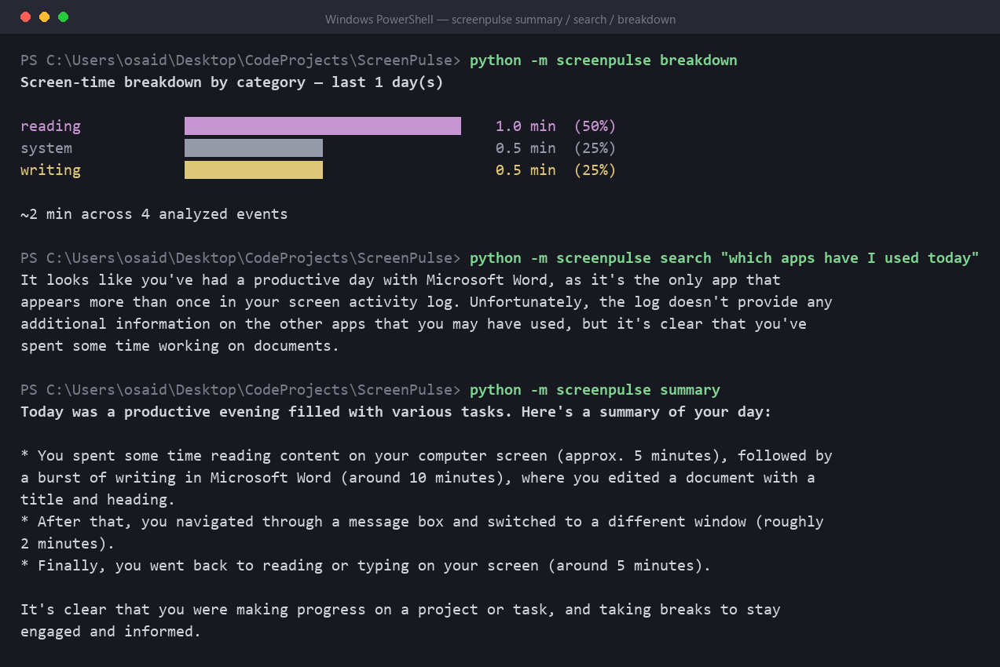

# ScreenPulse v1

ScreenPulse is a small desktop program that keeps a diary of what you do on your
computer. Every second or two it takes a screenshot, and when something on screen
has actually changed it asks a local AI model to describe what it sees. The
description is boiled down to a single line — which app, what you were doing, and
a rough category — and saved to a database on your machine. At the end of the day
you can ask it for a summary, search back through your history in plain English,
or look at how your time was split between apps.

Everything runs locally through [Ollama](https://ollama.com). No account, no API
key, nothing sent over the internet. Screenshots are held in memory just long
enough to be looked at and are never written to disk; only the one-line
descriptions are kept.

It is built for Windows and runs in the terminal.

The watch loop, mid-run — a changed frame goes to the model, the line under it is
what got saved, then the screen goes still and nothing is sent:



Asking about the day afterwards:



## Quickstart

You need Python 3.10+ and [Ollama](https://ollama.com) installed.

```bash
git clone https://github.com/itxoseid/ScreenPulse-v1.git
cd ScreenPulse-v1
python -m venv .venv
.venv\Scripts\activate
pip install -r requirements.txt

ollama pull qwen2.5vl:3b     # looks at the screen
ollama pull llama3.2:3b      # writes summaries, structures entries
ollama pull moondream        # optional: smaller, faster vision fallback

python -m screenpulse watch
```

First run creates the database and starts the live view. You should see a status
line ticking over (`Idle (change 0%)`), and within a few seconds of the screen
changing, the first entry. Press `q` to stop. On Windows you can also
double-click `run_screenpulse.bat`, which starts Ollama first if needed.

## How it works

The watch loop has a few stages, each one there to avoid doing expensive work
when it isn't needed:

1. **Capture.** A full-screen grab, taken about every 1.5 seconds and kept only
   in memory.
2. **Change check.** The frame is shrunk and compared pixel-by-pixel with the
   previous one. If almost nothing changed, it is dropped and nothing else runs.
3. **Gate.** Even a changed frame is skipped if the change is small (a blinking
   cursor, a scrolling ticker) or if the last AI call was less than 8 seconds
   ago.
4. **Describe.** Frames that pass the gate are sent to the vision model
   (`qwen2.5vl:3b`), along with the real title of the focused window, which
   returns a sentence or two about what is on screen.
5. **Structure.** A text model (`llama3.2:3b`) turns that into tidy fields:
   `app`, `activity_summary`, `category`. If it isn't available, ScreenPulse
   falls back to a description-only entry.
6. **Store.** The entry is written to a local SQLite database.

The terminal shows entries as they come in, colour-coded by category, with a
running breakdown of the day beside it.

## Using it

### Watch

```bash
python -m screenpulse watch          # live TUI
python -m screenpulse watch --no-tui # plain text to stdout
```

Press `q` to stop, `p` to pause and resume. While paused nothing is captured.
Capture also pauses automatically while a password manager or a Windows security
prompt is the focused window.

### Running in the background

Double-click **`run_screenpulse.bat`** (Windows). It starts Ollama if needed,
launches the watcher with no window (via `pythonw`, logging to
`%LOCALAPPDATA%\ScreenPulse\watch.log`), and closes itself immediately — the
watcher keeps running detached. Only one watcher runs at a time; running the
`.bat` again while one is active leaves it alone.

To stop it: end the `pythonw.exe` process (Task Manager) or run
`python -m screenpulse stop` from the project folder.

### Daily summary

```bash
python -m screenpulse summary
python -m screenpulse summary --date 2026-09-09
```

Reads the day's entries and writes a short "here is what you did today".

### Search your history

```bash
python -m screenpulse search "what was I working on this morning"
python -m screenpulse search "how much time did I spend reading yesterday"
```

Your question is turned into a database query (shown above the answer, so you can
see what it did), and the matching entries are summarised back to you. Only read
queries are ever run.

### Time breakdown

```bash
python -m screenpulse breakdown
python -m screenpulse breakdown --days 7 --by app
```

A bar chart of where your time went, grouped by category or by app.

### Export and trim

```bash
python -m screenpulse export --format csv --out today.csv
python -m screenpulse export --format json --days 7
python -m screenpulse prune --days 30     # delete entries older than 30 days
```

## What gets stored

One SQLite table, `events`:

| Column | Example | Notes |
|---|---|---|
| `id` | `142` | row id |
| `ts` | `2026-09-10T18:16:01` | local time the frame was captured |
| `app` | `Chrome` | foreground app / site (uses the real window info when available) |
| `window_title` | `chrome.exe — GitHub` | process name and window title from the OS |
| `activity_summary` | `Reading a GitHub pull request` | one sentence from the models |
| `category` | `browsing` | one of a fixed set (coding, reading, writing, meeting, …) |

Indexes on `ts` and `category` keep search and breakdown fast. The database file
is at `%LOCALAPPDATA%\ScreenPulse\screenpulse.db` — delete it to wipe everything,
or point elsewhere with `SCREENPULSE_DB`.

## Settings

All optional, set as environment variables:

| Variable | Default | What it does |
|---|---|---|
| `OLLAMA_HOST` | `http://localhost:11434` | where Ollama is listening |
| `SCREENPULSE_VISION_MODEL` | `qwen2.5vl:3b` | model that looks at the screen |
| `SCREENPULSE_TEXT_MODEL` | `llama3.2:3b` | model that writes summaries and structures entries |
| `SCREENPULSE_INTERVAL` | `1.5` | seconds between screenshots |
| `SCREENPULSE_DIFF_THRESHOLD` | `0.02` | how much of the screen must change to count |
| `SCREENPULSE_MIN_CALL_GAP` | `8.0` | shortest gap between AI calls, in seconds |
| `SCREENPULSE_DB` | `%LOCALAPPDATA%\ScreenPulse\screenpulse.db` | database location |

## Privacy

- **Screenshots are never written to disk.** Each frame lives in memory only
  until it has been described, then it is dropped. The JPEG sent to the vision
  model goes to `localhost` and is not kept.
- **What is stored** is the text: the one-line summary, the window title, the app
  name, the category, and the timestamp.
- **"Nothing leaves the computer"** assumes Ollama is the stock local build
  serving from `localhost`, and that you haven't pointed `OLLAMA_HOST` at a
  remote server. ScreenPulse itself makes no other network calls and has no
  telemetry.
- **The text can still be sensitive.** If a private message, an email, or a
  document is on screen, the model may quote part of it in the summary, and that
  line is saved. Use `p` to pause during anything sensitive, and `prune` or
  delete the database file to clear history.

## Troubleshooting

- **`Cannot reach Ollama`** — start it (`ollama serve` or the Ollama app) and
  retry.
- **`does not support generate/chat`** — that model's local files are broken,
  usually after an Ollama update. Run `ollama rm <model>` then `ollama pull
  <model>` to get a clean copy.
- **Slow analysis** — the vision model runs on the GPU if it fits, otherwise on
  the CPU. `qwen2.5vl:3b` needs ~3 GB of VRAM. Switch
  `SCREENPULSE_VISION_MODEL=moondream` for a lighter, faster (and vaguer) option.
- **Nothing being logged** — check the status line. A still screen produces
  nothing by design. To confirm writes are happening, run
  `python -m screenpulse export --format json` and look for recent rows.
- **Garbled bars or box characters in the terminal** — use Windows Terminal or
  any UTF-8 capable console; the classic `cmd.exe` window renders them poorly.

## Roadmap

**v1 – next**

- Auto-pause on a user-configurable list of apps and sites
- `--retention-days` so `watch` trims old entries on its own
- "Today vs yesterday" line in the summary

**v2 – later**

- Weekly and monthly trends
- Focus timer / nudge when a distracting category runs long
- A recap view, achievements
- A packaged installer

## Licence

MIT.
