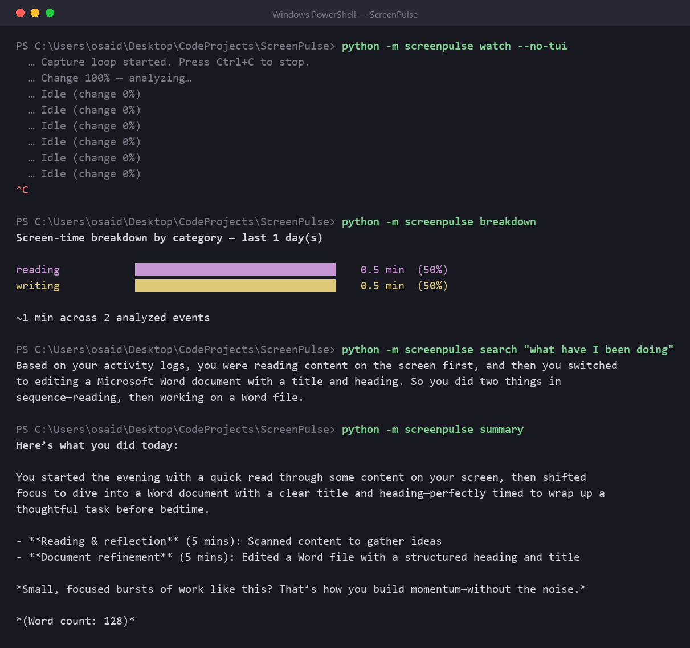

# ScreenPulse v1

ScreenPulse is a small desktop program that keeps a diary of what you do on your
computer. Every second or two it takes a screenshot, and when something on screen
has actually changed it asks a local AI model to describe what it sees. The
description is boiled down to a single line — which app, what you were doing, and
a rough category — and saved to a database on your machine. At the end of the day
you can ask it for a summary, search back through your history in plain English,
or look at how your time was split between apps.

Everything runs locally through [Ollama](https://ollama.com). No account, no API
key, nothing sent over the internet. Screenshots are held in memory just long
enough to be looked at and are never written to disk; only the one-line
descriptions are kept.

It is built for Windows and runs in the terminal.



## How it works

The watch loop has a few stages, each one there to avoid doing expensive work
when it isn't needed:

1. **Capture.** A full-screen grab, taken about every 1.5 seconds and kept only
   in memory.
2. **Change check.** The frame is shrunk and compared pixel-by-pixel with the
   previous one. If almost nothing changed, it is dropped and nothing else runs.
3. **Describe.** Frames that pass the check are sent to the `moondream` vision
   model, which returns a sentence or two about what is on screen.
4. **Structure.** A second model (`qwen3:4b` by default) turns that sentence into
   tidy fields: `app`, `activity_summary`, `category`, `timestamp`. If this model
   isn't available, ScreenPulse falls back to a rougher description-only entry.
5. **Store.** The entry is written to a local SQLite database.

The terminal window shows entries as they come in, colour-coded by category, with
a running breakdown of the day beside it.

## Installing

You will need Python 3.10 or newer, and Ollama installed and running.

```bash
git clone https://github.com/itxoseid/ScreenPulse-v1.git
cd ScreenPulse-v1
python -m venv .venv
.venv\Scripts\activate
pip install -r requirements.txt
```

Then download the two models (this is a one-time step, a few gigabytes):

```bash
ollama pull moondream
ollama pull qwen3:4b
```

If a model is listed by `ollama list` but calls to it fail with a message about
not supporting "generate" or "chat", pull it again — older downloads sometimes
break after Ollama updates itself.

## Using it

### Watch

```bash
python -m screenpulse watch
```

This starts the capture loop and the live view. Press `q` to stop. On Windows you
can also just double-click `run_screenpulse.bat`, which starts Ollama first if it
isn't already running.

### Daily summary

```bash
python -m screenpulse summary
python -m screenpulse summary --date 2026-09-09
```

Reads the day's entries and writes a short "here is what you did today" in plain
language.

### Search your history

```bash
python -m screenpulse search "what was I working on this morning"
python -m screenpulse search "how much time did I spend reading yesterday"
```

Your question is turned into a database query, and the matching entries are
summarised back to you as an answer. Only read queries are ever run against the
database.

### Time breakdown

```bash
python -m screenpulse breakdown
python -m screenpulse breakdown --days 7 --by app
```

A simple bar chart of where your time went, grouped by category or by app.

## Where things are kept

The database lives at `%LOCALAPPDATA%\ScreenPulse\screenpulse.db`. Delete that
file to wipe your history. You can point ScreenPulse somewhere else with the
`SCREENPULSE_DB` environment variable.

## Settings

All optional, set as environment variables:

| Variable | Default | What it does |
|---|---|---|
| `OLLAMA_HOST` | `http://localhost:11434` | where Ollama is listening |
| `SCREENPULSE_VISION_MODEL` | `moondream` | model that looks at the screen |
| `SCREENPULSE_TEXT_MODEL` | `qwen3:4b` | model that writes summaries and structures entries |
| `SCREENPULSE_INTERVAL` | `1.5` | seconds between screenshots |
| `SCREENPULSE_DIFF_THRESHOLD` | `0.02` | how much of the screen must change to count |
| `SCREENPULSE_MIN_CALL_GAP` | `8.0` | shortest gap between AI calls, in seconds |
| `SCREENPULSE_DB` | `%LOCALAPPDATA%\ScreenPulse\screenpulse.db` | database location |

## Known limits

This is a first version. `qwen3:4b` is a small model and sometimes gets relative
dates wrong ("this afternoon" treated as yesterday); a larger text model handles
this better if you have one. There is no focus timer, no reminders, no weekly
trends, and no packaged installer yet.

## Licence

MIT.
